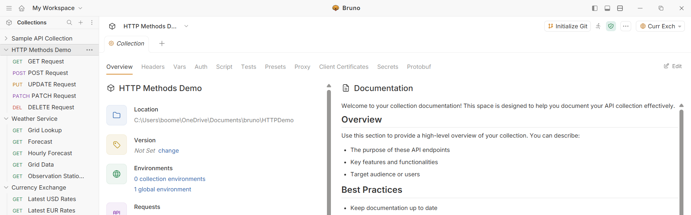
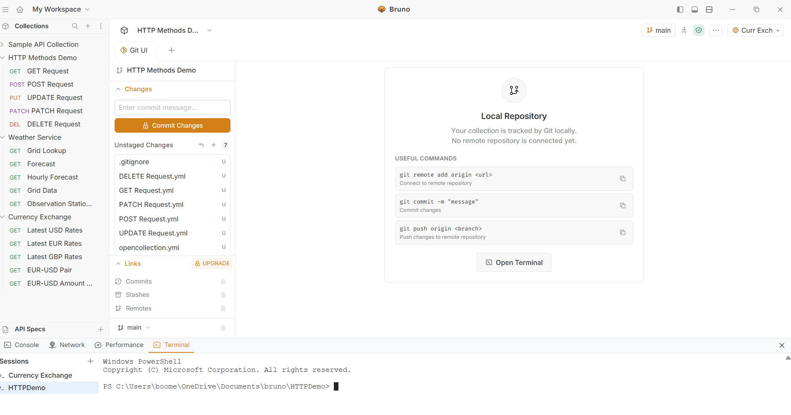
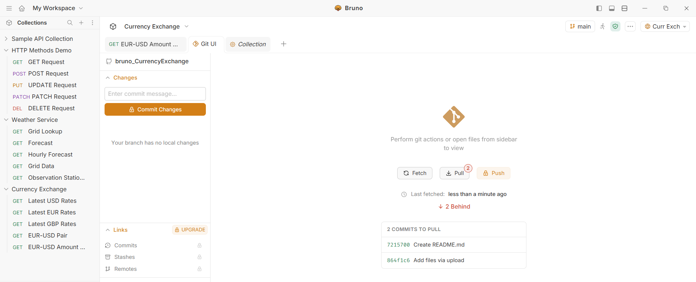
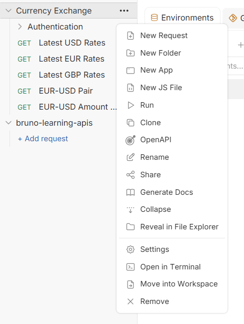
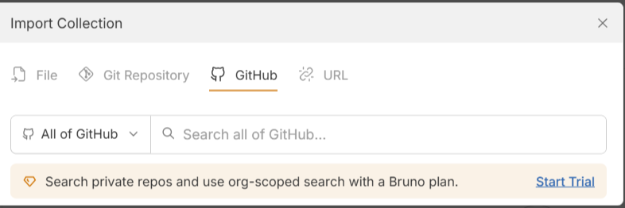
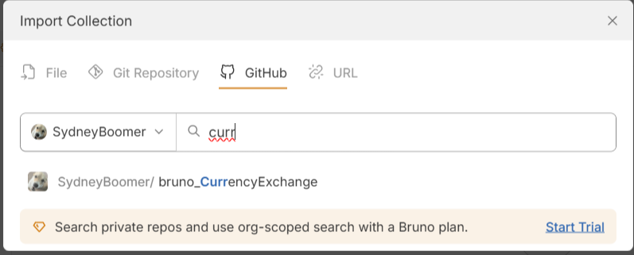
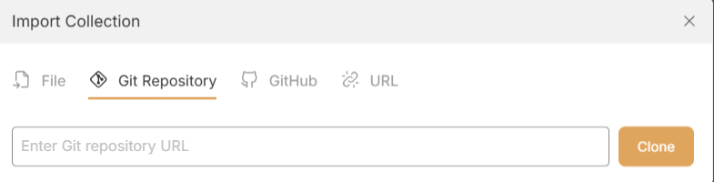
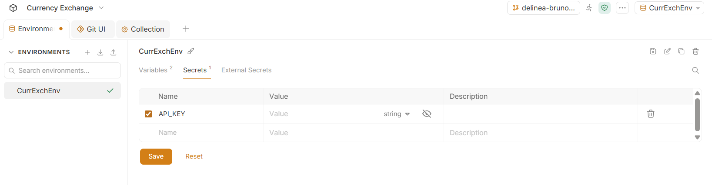
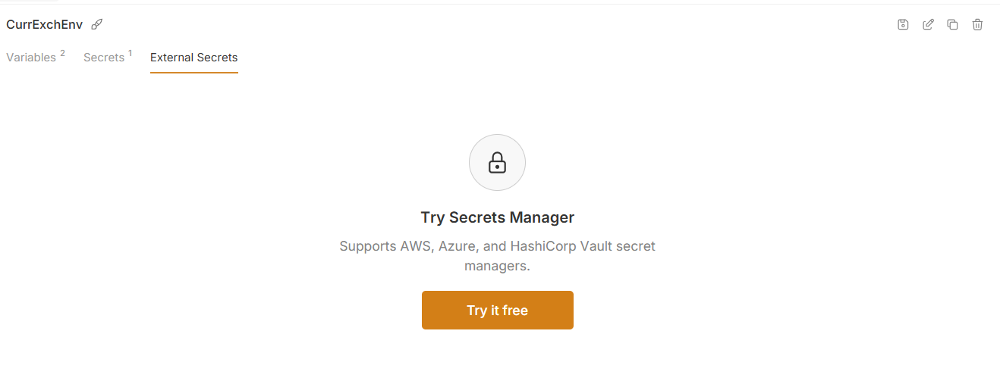
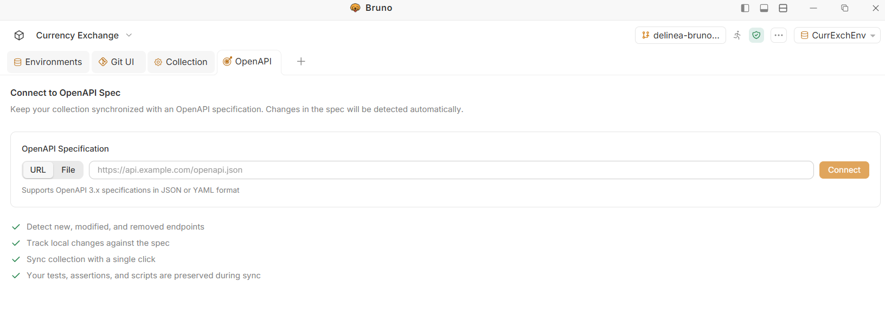

# GitHub Repository Setup & Secret Management

## Current Steps Taken

### 1. Initialize Git Repository

### 2. Configure Git Using the Terminal

### 3. Pull the Repository

---

## 08/28

## 4. Opening the Collection in the Terminal

## 5. Opening a GitHub Repository

## 6. Open My Repository

## 7. Import a Private Repository

## 8. Verify Secret Key Handling

The secret key was verified to ensure that it was not stored directly in the repository.

## 9. Configurable External Secrets Manager

Does not specifically have Delinea built in.  Maybe could use scripts...

## 10. OpenAPI

